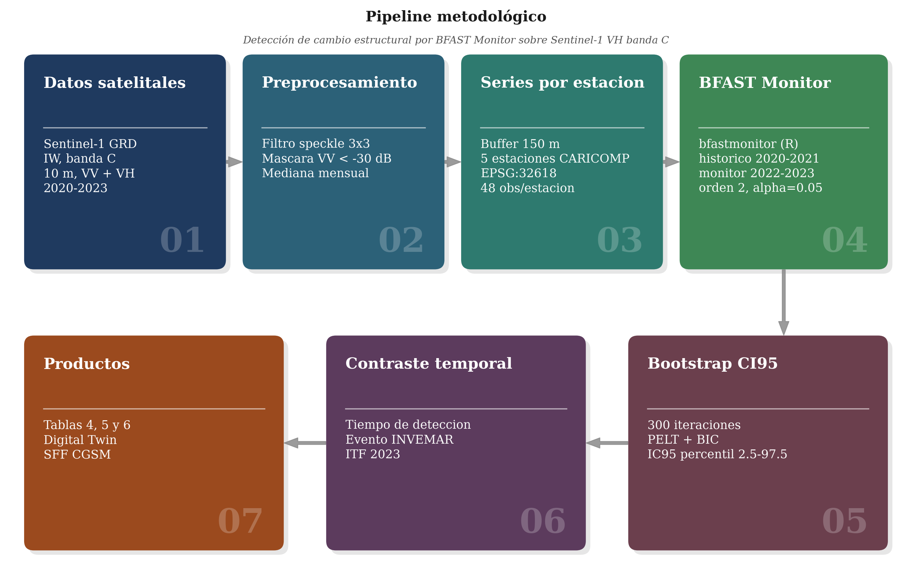

Universidad Nacional de Colombia

Facultad de Ciencias Agrarias, Maestría en Geomática

Percepción Remota, Informe 2

Lina María Quintero Fonseca

29 de mayo de 2026

Repositorio: https://github.com/linaq11/Informe_2

# BFAST Monitor sobre Sentinel-1 para detección de cambio estructural en el manglar de la Ciénaga Grande de Santa Marta

## Resumen

El monitoreo del manglar de la Ciénaga Grande de Santa Marta (CGSM) requiere productos satelitales capaces de detectar cambios estructurales bajo cobertura nubosa recurrente. El componente A del presente Informe 2 mostró que la clasificación supervisada Random Forest sobre Sentinel-1 banda C no resuelve la pregunta sobre el estado estructural instantáneo del manglar: la concordancia frente a las mediciones del programa Caribbean Coastal Marine Productivity (CARICOMP) del Instituto de Investigaciones Marinas y Costeras (INVEMAR) (Beltrán et al. 2022) es modesta y las bandas SAR no aportan información discriminativa al clasificador. Como respuesta, este trabajo reformula la pregunta hacia la detección de cambios respecto a una línea base reciente y aplica BFAST Monitor (Breaks For Additive Season and Trend, Verbesselt et al. 2012) a series mensuales de retrodispersión cruzada (VH) en banda C de las cinco estaciones permanentes CARICOMP, con un período histórico 2020-2021 y un período de monitoreo 2022-2023. El algoritmo detectó cambios estructurales significativos en las cinco estaciones entre abril de 2022 y octubre de 2023, con magnitudes entre 0.35 y 1.73 decibelios. La secuencia de las primeras alertas (Aguas Negras, Luna, Rinconada, Km22 y Caño Grande) se interpreta como un gradiente de sensibilidad al evento climático-hidrológico de 2022-2023 y resulta consistente con la pérdida del 33 % del arbolado en Aguas Negras reportada por el Informe Técnico Final 2023 del INVEMAR (INVEMAR 2024). En esta estación la alerta del modelo precedió en seis meses al inicio del período documentado, detección anticipada que respalda la utilidad de un gemelo digital de la CGSM como sistema de alerta temprana y motiva un cambio de criterio de validación: del coeficiente kappa de Cohen sobre parcelas estáticas, hacia el tiempo entre el evento real y la fecha de alerta del modelo. El aporte central de este trabajo es una prueba de concepto: el mismo Sentinel-1 banda C que no resuelve la pregunta de estado sí responde a la pregunta de cambio, lo que permite aprovechar la infraestructura disponible mientras se transita hacia banda L.

## 1. Introducción

El manglar de la Ciénaga Grande de Santa Marta es el ecosistema costero más extenso del Caribe colombiano y sustenta servicios ambientales esenciales para las comunidades costeras y la pesca artesanal de la región (Ibarra et al. 2014). Su monitoreo continuo presenta dos limitaciones técnicas que motivan el presente trabajo: por un lado, la cobertura nubosa recurrente durante la temporada lluviosa restringe el uso del sensor óptico Sentinel-2; por otro, el muestreo institucional anual o semestral del INVEMAR (INVEMAR 2024) no captura con suficiente resolución temporal la variabilidad estructural del manglar bajo regímenes climáticos cambiantes. Sentinel-1 en banda C (Copernicus 2014) ofrece una alternativa con revisitas entre seis y doce días, independiente de las condiciones atmosféricas, pero su capacidad para responder preguntas sobre el estado y el cambio del manglar requiere validación empírica sobre este sistema lagunar.

### 1.1 Antecedentes

El sistema lagunar CGSM cuenta con un programa de monitoreo estructural ininterrumpido desde mediados de los años noventa. Está coordinado por el INVEMAR en el marco regional del programa CARICOMP. El Informe Técnico Final consolidado por Ibarra et al. (2014) sintetiza el monitoreo acumulado hasta 2014 en las cinco estaciones permanentes. Caracteriza la dinámica del área basal, la densidad arbórea y la salinidad intersticial bajo regímenes hidrológicos contrastantes. Los datos estructurales del programa CARICOMP en las cinco estaciones entre 1995 y 2021 se publican en el Darwin Core Archive (DwC-A) de la Global Biodiversity Information Facility (GBIF) bajo el DOI 10.15472/2poedl (Beltrán et al. 2022). Estos datos sirven como referencia cuantitativa para la validación satelital. Más recientemente, el Informe Técnico Final 2023 (INVEMAR 2024) actualiza la serie hasta septiembre de 2023 y documenta una pérdida del 33 % del arbolado en la estación Aguas Negras entre octubre de 2022 y septiembre de 2023. Este evento reciente conecta los antecedentes de monitoreo con el enfoque principal de validación del presente trabajo.

El algoritmo BFAST, propuesto por Verbesselt et al. (2010) sobre series del Índice de Vegetación de Diferencia Normalizada (NDVI) del sensor MODIS (Moderate Resolution Imaging Spectroradiometer), descompone la señal en componentes de tendencia, estacionalidad y ruido, y detecta rupturas mediante una prueba de cambio estructural sobre los residuales. La variante BFAST Monitor (Verbesselt et al. 2012) adapta el algoritmo para detectar cambios cerca del momento en que ocurren: compara una ventana histórica estable con una ventana de monitoreo activa mediante el estadístico OLS-MOSUM (Ordinary Least Squares - Moving Sum), que identifica la primera fecha en la que la divergencia entre ambas ventanas se vuelve estadísticamente significativa.

Hasta ahora, la mayoría de las aplicaciones publicadas del algoritmo se concentra en bosques templados y boreales con series ópticas. Los análisis sobre manglares neotropicales son escasos, y no hay aplicaciones publicadas que combinen BFAST Monitor con series mensuales de VH banda C de Sentinel-1 sobre las estaciones CARICOMP de la CGSM.

Zhu, Liao y Shen (2021) documentaron sobre los manglares de la Reserva Natural Qinglangang (Hainan, China) que las series temporales de Sentinel-1 son útiles para detectar cambios estructurales a lo largo del tiempo pero presentan límites para discriminar instantáneamente el estado de degradación del bosque. Este hallazgo coincide con los resultados del presente informe. La literatura sobre SAR banda L apunta consistentemente a una mejor sensibilidad estructural: la longitud de onda más larga penetra el dosel y la retrodispersión correlaciona positivamente con la densidad arbórea y la biomasa aérea. Cornforth et al. (2013), sobre los manglares de los Sundarbans, demostraron que la polarización HV de ALOS PALSAR permite estimar biomasa aérea con precisión razonable bajo dosel denso. Cardenas et al. (2022) y Lee et al. (2021) extienden este resultado mostrando que la combinación de banda L con análisis textural permite distinguir áreas degradadas de áreas en regeneración. El conjunto sustenta la migración futura a banda L como continuación natural del trabajo, sin abandonar el potencial actual de la banda C para la detección temporal de cambios.

El Informe 1 evaluó la viabilidad de Sentinel-2 para el mapeo continuo del estado del manglar en la CGSM mediante clasificación supervisada Random Forest (Breiman 2001) sobre composites medianos de temporada seca para los años 2020 a 2023. El componente A del presente Informe 2 extendió ese ejercicio: validó las predicciones del clasificador contra los datos estructurales CARICOMP descritos arriba e incorporó composites lluviosos de Sentinel-1 en banda C (Copernicus 2014) como predictores adicionales. Ese componente produjo cinco hallazgos convergentes que la §1.2 desarrolla en detalle y que motivan la reformulación de la pregunta de investigación en el presente trabajo.

Hasta la fecha, ningún estudio publicado ha aplicado BFAST Monitor sobre series mensuales de VH banda C de las estaciones CARICOMP de la CGSM para detectar cambios estructurales de manera anticipada, ni ha validado cuantitativamente las fechas de los breakpoints del modelo frente a los eventos documentados por el monitoreo institucional del INVEMAR. Esa brecha justifica y orienta el componente principal del presente informe.

### 1.2 Limitaciones del componente A

El componente A entrenó un clasificador Random Forest que fusiona Sentinel-2 en temporada seca con Sentinel-1 en temporada húmeda. Sobre ese clasificador se aplicaron cinco pruebas de robustez, cada una orientada a evaluar una decisión metodológica que podía explicar la concordancia modesta (45 %) frente a las mediciones CARICOMP del INVEMAR. En conjunto, las pruebas establecieron que la fusión óptico-SAR banda C no resuelve plenamente la pregunta sobre el estado estructural del manglar de la CGSM y motivaron la reformulación hacia la pregunta de detección de cambio enunciada en §1.3. La Tabla 1 sintetiza los cinco hallazgos cuantitativos.

**Tabla 1. Síntesis de las cinco pruebas de robustez aplicadas al clasificador estático Random Forest del componente A. El detalle cuantitativo de cada prueba se encuentra en el anexo correspondiente.**

| Anexo | Prueba | Hallazgo cuantitativo | Implicación |
|---|---|---|---|
| E | Sensibilidad a unidad de validación (5 estaciones reubicadas vs 15 parcelas Darwin Core Archive (DwC-A) exactas) | Concordancia 22 %, Kappa = −0.137 [IC95 −0.234, −0.049] sobre 90 obs | La clase Regular nunca es asignada por el clasificador |
| F | Autocorrelación espacial de residuales del RF reentrenado | Moran I = 0.351, p = 0.010 sobre 15 parcelas; rango variograma ≈ 8 km | Los errores se distribuyen como conglomerados espaciales, no como ruido aleatorio |
| G | Sensibilidad a percentiles de área basal (BA) que definen las clases estructurales | Concordancia oscila 40-50 %, Kappa entre +0.05 y +0.18, IC95 incluye cero en los 4 esquemas | La conclusión es invariante a la elección de umbrales razonable |
| I | Area of Applicability sobre el AOI 5 053 km² (Meyer & Pebesma 2021) | 63.2 % del AOI fuera del envoltorio multivariado de entrenamiento; importancia SAR = 0 | La fusión óptico-SAR es efectivamente óptica; mayoría del AOI es extrapolación |
| J | Comparación RF vs GPBoost (Gradient Boosting + Gaussian Process) bajo estrategia One-vs-Rest (OvR) con proceso gaussiano sobre coordenadas | RF Kappa = −0.224, GPBoost Kappa = −0.389 en 4 clases; sin clase 2 generable por Hansen | El cambio de algoritmo no rescata; sistema bimodal Hansen confirmado |

El segundo hallazgo de la Tabla 1, la autocorrelación espacial positiva de los residuales del clasificador, resultó decisivo en la reformulación discutida. La Figura 3 resume el diagnóstico aplicado sobre las quince parcelas Darwin Core Archive del INVEMAR mediante el índice de Moran global y un variograma esférico; el detalle metodológico se reporta en el Anexo F.

El Anexo J examina si la limitación documentada en las cuatro pruebas anteriores responde al algoritmo Random Forest o a los datos del sensor. Para discernirlo, sustituye el Random Forest por un GPBoost que incorpora un proceso gaussiano explícito sobre las coordenadas geográficas (Sigrist 2020, 2021), de modo que la autocorrelación espacial residual pase a estar modelada de forma explícita en lugar de quedar como ruido. El resultado no respalda la hipótesis algorítmica: el GPBoost no mejora el desempeño del Random Forest y lo empeora bajo todos los esquemas de cardinalidad evaluados. La limitación física de la fusión óptico-SAR banda C permanece, en consecuencia, como única explicación coherente del conjunto de hallazgos. La Tabla 2 reporta el análisis de sensibilidad a la cardinalidad de clases.

**Tabla 2. Sensibilidad de la concordancia y del kappa a la cardinalidad de clases para los dos algoritmos comparados sobre quince parcelas DwC-A del INVEMAR. Detalle metodológico en el Anexo J.**

| Esquema de clases | Modelo | Concordancia | Kappa |
|---|---|---|---|
| 4 clases (original) | Random Forest | 3/15 = 20.0 % | −0.224 |
| 4 clases (original) | GPBoost OvR | 0/15 = 0.0 % | −0.389 |
| **3 clases, Regular reagrupado con Intacto** | **Random Forest** | **9/15 = 60.0 %** | **−0.250** |
| 3 clases, Regular reagrupado con Intacto | GPBoost OvR | 3/15 = 20.0 % | −0.429 |
| 3 clases, Regular reagrupado con Degradado | Random Forest | 5/15 = 33.3 % | −0.389 |
| 3 clases, Regular reagrupado con Degradado | GPBoost OvR | 3/15 = 20.0 % | −0.667 |

Las Tablas 1 y 2 muestran dos rasgos del manglar de la CGSM que las cinco pruebas anteriores no logran resolver con SAR banda C. El primero es su bimodalidad estructural. Al aplicar el filtro Hansen Global Forest Change v1.12 (Hansen et al. 2013) sobre el manglar canónico de Giri (Giri et al. 2011), el bosque aparece en cobertura densa superior al 80 % o en cobertura baja inferior al 40 %, sin valores intermedios detectables; la clase Regular no produce candidatos ni siquiera con 50 000 puntos aleatorios sobre el AOI (Anexo J). El segundo es el aporte nulo del SAR banda C al clasificador de fusión: la importancia agregada del SAR es igual a cero tanto en Random Forest como en GPBoost (Anexos I y J), de modo que la fusión óptico-SAR del componente A se reduce, sobre las muestras del reentrenamiento, a una fusión óptica.

### 1.3 Pregunta de investigación

Frente a este escenario, el presente informe formula la siguiente pregunta de investigación:

> **Pregunta principal.** ¿Cuándo ocurrieron cambios estructurales significativos en el manglar de la CGSM detectables por Sentinel-1 banda C durante el período 2020–2023?
>
> **Sub-pregunta.** ¿Qué consistencia presenta la fecha de primera alerta del modelo frente a los eventos de mortalidad o perturbación documentados por el reporte INVEMAR ITF 2023 sobre las mismas estaciones?

### 1.4 Objetivos

**Objetivo general.** Validar Sentinel-1 banda C como detector temporal de cambio estructural en el manglar de la Ciénaga Grande de Santa Marta mediante el algoritmo BFAST Monitor sobre las cinco estaciones permanentes del programa CARICOMP del INVEMAR.

**Objetivos específicos.**

1. Construir series mensuales VH agregadas sobre las cinco estaciones permanentes CARICOMP para el período 2020 a 2023 y aplicar el algoritmo BFAST Monitor con período histórico 2020-2021 y monitoreo 2022-2023 según la formulación de Verbesselt et al. (2012).
2. Estimar la incertidumbre temporal de cada breakpoint detectado mediante un bootstrap de 300 iteraciones sobre los residuales del componente armónico-estacional, siguiendo a Verbesselt et al. (2010), para producir intervalos de confianza al 95 % (CI95) de la fecha de cada cambio.
3. Comparar la fecha y la magnitud de las primeras alertas BFAST Monitor con los eventos de mortalidad y perturbación reportados por INVEMAR ITF 2023 sobre las mismas estaciones, calculando la latencia (en meses) entre la alerta del modelo y el inicio del evento documentado.

**Tabla 3. Mapeo entre objetivos específicos y secciones de resultados conforme a la heurística Thomson (aim, objectives, deliverables).**

| Objetivo específico | Método (§3) | Resultado (§4) | Anexo de soporte |
|---|---|---|---|
| O1. Construir series VH y aplicar BFAST Monitor | §3.3.1 | §4.1 Primeras alertas y magnitud del cambio | Anexo H |
| O2. Complementar con bootstrap CI95 | §3.3.2 | §4.2 Intervalos de confianza de los breakpoints | Anexo H |
| O3. Evaluar tiempo de detección contra INVEMAR | §3.3.3 | §4.3 Tiempo de detección frente a eventos INVEMAR | Anexo K |

## 2. Área de estudio

La CGSM constituye el complejo lagunar costero más extenso de Colombia (Ibarra et al. 2014), ubicado en el departamento del Magdalena entre la desembocadura del río Magdalena al occidente y la Sierra Nevada de Santa Marta al oriente. El sistema se analiza en tres escalas anidadas. La escala regional corresponde al área de interés (AOI) completa de 5 053 km² heredada del Informe 1, sobre la cual se ejecutan la clasificación SAR estática del componente A y la detección de cambio del presente trabajo. La escala intermedia corresponde al Complejo de Pajarales, sector Ma16 del Santuario de Fauna y Flora (SFF) CGSM con 110.6 km² de cinturón estricto de manglar, según el polígono operativo del servicio SIGMA del INVEMAR; en este sector se concentran las dos estaciones más perturbadas del programa CARICOMP (Beltrán et al. 2022): Aguas Negras y Luna. La escala puntual corresponde a buffers de 150 m de radio alrededor de las cinco estaciones permanentes del INVEMAR: Aguas Negras (ANE), Caño Grande (CGE), Km22 (KM22), Luna (LUN) y Rinconada (RIN). Sobre estos buffers se construyen las series temporales mensuales VH que alimentan el análisis BFAST Monitor del presente trabajo. La distribución espacial de estas tres escalas se reporta en la Figura 1.

## 3. Materiales y métodos

Todos los procesos espaciales se ejecutan sobre el sistema de referencia EPSG:32618 (UTM zona 18 Norte, WGS84), elegido por cuatro razones. Primera, la zona UTM 18 Norte cubre íntegramente el rango longitudinal de la CGSM (entre 74.88° W y 74.08° W). Segunda, la proyección preserva la métrica plana dentro de la zona, lo que garantiza el cálculo correcto de áreas en kilómetros cuadrados, de distancias en metros para los buffers de 150 m sobre las estaciones y de operaciones de superposición píxel a píxel sin distorsión angular significativa. Tercera, coincide con la malla nativa de los tiles Sentinel-2 en la región, lo que evita remuestreo intermedio que altere los valores de reflectancia originales. Cuarta, garantiza compatibilidad píxel a píxel con los productos del Informe 1 y con las bases globales utilizadas en los anexos (Giri et al. 2011, Hansen et al. 2013, ESA WorldCover), todas distribuidas nativamente en EPSG:4326 sobre el datum WGS84; la reproyección a EPSG:32618 implica únicamente cambio de sistema de proyección sin transformación de datum, lo que preserva la posición geodésica original con exactitud sub-métrica.

### 3.1 Datos satelitales

#### 3.1.1 Sentinel-1 (banda C, VV/VH)

Las series corresponden a productos Sentinel-1 GRD (Ground Range Detected) en modo Interferometric Wide (IW), distribuidos por Copernicus a partir del dato crudo SLC (Single Look Complex) tras procesos de detección y multilook. Sobre esa información, el presente trabajo genera productos derivados mediante agregación temporal y detección de breakpoints. El producto GRD presenta cuatro resoluciones: espacial de 10 m; temporal nominal de 6 a 12 días sobre la CGSM con la combinación de las pasadas ascendente y descendente; espectral en banda C (longitud de onda λ ≈ 5.6 cm) con polarización dual VV (emisión y recepción vertical) y VH (emisión vertical, recepción horizontal); y radiométrica de 16 bits en amplitud sigma cero convertida a escala logarítmica de decibelios (10·log₁₀).

Para garantizar consistencia geométrica entre escenas se filtra únicamente por dirección de órbita descendente. El preprocesamiento aplica filtro de speckle por mediana focal 3×3 píxeles, máscara de bordes con umbral VV < −30 decibelios y agregación temporal mensual por mediana sobre buffers de 150 m alrededor de cada estación. La ventana temporal de análisis se restringe a enero de 2020 hasta diciembre de 2023, lo que produce 48 observaciones por estación; esta longitud es suficiente para ajustar el modelo armónico de segundo orden de BFAST Monitor sobre el bienio histórico 2020-2021 y mantiene cobertura completa del bienio de monitoreo 2022-2023 que el reporte INVEMAR ITF 2023 identifica como ventana del evento climático-hidrológico bajo análisis.

#### 3.1.2 Sentinel-2 (óptico)

Se construyen series mensuales paralelas de NDVI, NIR (B8) y SWIR (B11) sobre los mismos buffers, derivadas de Sentinel-2 SR (Surface Reflectance) Harmonized con enmascaramiento de nubes CloudScore+ con umbral 0.3. Estas series se utilizan como capa de apoyo para distinguir cambios de cobertura efectiva (detectables ópticamente) de cambios estructurales bajo dosel (detectables idealmente solo por SAR de mayor longitud de onda, como la banda L).

### 3.2 Datos de campo

El monitoreo CARICOMP del INVEMAR (Beltrán et al. 2022) provee la serie estructural 1995-2021 sobre las cinco estaciones permanentes, complementada por el reporte INVEMAR ITF 2023 (INVEMAR 2024) que documenta una pérdida del 33 % del arbolado en Aguas Negras durante el período octubre 2022 a septiembre 2023. La selección de las cinco estaciones (Aguas Negras, Caño Grande, Km22, Luna y Rinconada) obedece a tres criterios. Primero, son las únicas estaciones permanentes del programa con serie continua de área basal y densidad arbórea entre 1995 y 2021 publicada en el Darwin Core Archive (DwC-A) de GBIF. Segundo, todas aparecen en el reporte INVEMAR ITF 2023 con caracterización individual del evento climático-hidrológico que sostiene la sub-pregunta del presente trabajo. Tercero, distribuyen espacialmente los cuatro sectores del SFF CGSM identificados por el INVEMAR, lo que permite leer la secuencia temporal de las primeras alertas como gradiente sobre el sistema lagunar y no como artefacto de muestreo concentrado. Los eventos documentados por CARICOMP que se utilizan como referencia para validación cualitativa del modelo de detección de cambio son:

| Evento | Estación | Año | Magnitud documentada |
|---|---|---|---|
| Colapso estructural Luna | LUN | 2017 | −87 % de BA respecto a 2016 |
| Pérdida sostenida densidad Km22 | KM22 | 2015-2018 | −92 % densidad, sin recuperación |
| Pérdida arbolado Aguas Negras | ANE | 2022-2023 | −33 % arbolado |
| Estabilidad Rinconada | RIN | 1995-2024 | Sin pérdidas documentadas |
| Recuperación parcial Caño Grande | CGE | 2018-2021 | Ganancia BA 17.3 % |

### 3.3 Métodos

El diseño del estudio corresponde a un análisis observacional de series temporales bajo el esquema cuasi-experimental tipo serie temporal interrumpida. La interrupción de interés es el cambio estructural detectado por el modelo armónico-estacional respecto a la línea base 2020-2021. La variable dependiente se define como el par ordenado (fecha del breakpoint en años decimales, magnitud del cambio en decibelios). Las variables independientes son la serie mensual VH banda C por estación, el período histórico de calibración fijado en 2020-2021 y el nivel de significancia α = 0.05; las covariables ambientales del régimen climático-hidrológico de 2022-2023 entran como factor de interpretación frente a los eventos documentados por INVEMAR. Las tres subsecciones siguientes desarrollan el modelado principal por BFAST Monitor (§3.3.1), la cuantificación de la incertidumbre temporal mediante bootstrap (§3.3.2) y el contraste temporal frente a eventos documentados que opera como métrica de desempeño del modelo (§3.3.3). El pipeline completo, desde el producto Sentinel-1 GRD hasta los productos finales del presente trabajo, se sintetiza en la Figura 2.

#### 3.3.1 BFAST Monitor

Se aplica la función `bfast::bfastmonitor` del paquete R (Verbesselt et al. 2012) sobre la serie mensual VH de cada estación con período histórico estable definido como 2020-2021 (history = c(2020, 1)), período de monitoreo iniciando en enero de 2022 (start = c(2022, 1)), modelo armónico de segundo orden sobre el ciclo anual (formula = response ~ harmon, order = 2) y nivel de significancia α = 0.05. La implementación reporta la primera fecha del período de monitoreo donde el estadístico OLS-MOSUM (Ordinary Least Squares - Moving Sum) acumulado sobre los residuales del modelo histórico cruza el umbral asintótico correspondiente al nivel de significancia, junto con la magnitud del cambio expresada como diferencia promedio entre la predicción del modelo histórico y la serie observada en el período de monitoreo. El cuaderno `bfast_monitor.Rmd` incluido en el repositorio reproduce el análisis completo. La implementación en Python complementaria del Anexo H se mantiene como validación cruzada metodológica.

#### 3.3.2 Intervalos de confianza por bootstrap

El BFAST Monitor se complementa con un bootstrap de 300 iteraciones sobre los residuales del componente armónico-estacional según Verbesselt et al. (2010). El procedimiento ajusta el modelo armónico sobre la serie completa, remuestrea los residuales con reposición, los suma al ajuste original para producir una serie sintética y detecta el breakpoint sobre cada réplica mediante PELT (Pruned Exact Linear Time) con penalización BIC (Bayesian Information Criterion). El intervalo de confianza al 95 % de la fecha del breakpoint se obtiene como el rango entre los percentiles 2.5 y 97.5 de la distribución de breakpoints bootstrap.

#### 3.3.3 Contraste temporal con eventos INVEMAR

La concordancia entre la fecha de primera alerta BFAST Monitor y la fecha del evento estructural documentado por CARICOMP o por INVEMAR ITF 2023 se evalúa estación por estación. La métrica de validación es el tiempo de detección, definido como la diferencia en meses entre la fecha del evento documentado y la fecha de primera alerta del modelo. Tiempos negativos indican detección anticipada del modelo respecto al reporte de campo; tiempos positivos indican detección posterior. La magnitud del cambio reportada por BFAST Monitor en decibelios funciona como tamaño del efecto (effect size) del breakpoint, complementando el reporte de significancia y de intervalo de confianza; la conversión a escala lineal mediante la relación porcentual 100 · (1 − 10^(−ΔdB/10)) permite interpretación intuitiva del cambio (1.73 dB ≡ 33 % de caída del backscatter, 0.40 dB ≡ 9 %, 0.35 dB ≡ 8 %). La asunción metodológica es que el SAR detecta el cambio estructural en tiempo cercano al evento físico mientras que el reporte CARICOMP lo documenta meses o años después según el ciclo de muestreo del programa.

## 4. Resultados

### 4.1 Primeras alertas y magnitud del cambio

Se aplica `bfast::bfastmonitor` sobre las cinco estaciones permanentes con período histórico 2020-2021 y monitoreo iniciando en enero de 2022. El algoritmo identifica primeras alertas significativas (α = 0.05) en las cinco estaciones, distribuidas en el tiempo entre abril de 2022 y octubre de 2023. La Tabla 4 reporta la fecha de primera alerta y la magnitud del cambio en decibelios para cada estación, con las filas ordenadas cronológicamente.

**Tabla 4. BFAST Monitor: primera fecha de alerta y magnitud del cambio en decibelios por estación. Período histórico 2020-2021, monitoreo 2022-2023, nivel de significancia α = 0.05.**

| Estación | Primera alerta | Año decimal | Magnitud (dB) |
|---|---|---|---|
| Aguas Negras | Abr 2022 | 2022.250 | 1.73 |
| Luna | May 2022 | 2022.333 | 0.86 |
| Rinconada | May 2022 | 2022.333 | 0.40 |
| Km22 | Ago 2022 | 2022.583 | 1.15 |
| Caño Grande | Oct 2023 | 2023.750 | 0.35 |

La distribución temporal de las primeras alertas inicia en abril de 2022 en Aguas Negras, abarca el segundo trimestre de 2022 con alertas simultáneas en Luna y Rinconada en mayo, continúa con Km22 a mediados de 2022 y culmina con Caño Grande en octubre de 2023. Las magnitudes oscilan entre 0.35 decibelios en Caño Grande y 1.73 decibelios en Aguas Negras, y la estación más temprana presenta la magnitud máxima. En escala lineal (obtenida mediante la conversión `ratio = 10^(ΔdB / 10)`), las cinco magnitudes corresponden a incrementos del backscatter VH respecto al modelo histórico de aproximadamente 8 % en Caño Grande, 10 % en Rinconada, 22 % en Luna, 30 % en Km22 y 49 % en Aguas Negras. El signo positivo del cambio en las cinco estaciones indica que el VH observado durante el período de monitoreo está sistemáticamente por encima del predicho por el modelo 2020-2021, comportamiento que se asocia con modificaciones del régimen de inundación, exposición de superficies de doble rebote tronco-agua por apertura del dosel o cambios en el contenido hídrico foliar durante el evento El Niño 2022-2023.

### 4.2 Intervalos de confianza de los breakpoints

El bootstrap sobre los residuales del componente armónico-estacional produce intervalos de confianza al 95 % de la fecha de cada breakpoint individual reportados en la Tabla 5. Las amplitudes oscilan entre 18 y 31 meses en las cinco estaciones, magnitud considerable que refleja la sensibilidad del estimador puntual de fecha a perturbaciones modestas de los residuales en series cortas de 48 meses.

**Tabla 5. Breakpoints VH detectados por implementación en Python tipo BFASTlite con bootstrap de 300 iteraciones sobre residuales.**

| Estación | Breakpoint (año decimal) | IC 95 % bootstrap | Amplitud (meses) | P(sin breakpoint) |
|---|---|---|---|---|
| Aguas Negras | 2021.42 | [2020.92, 2022.42] | 18.0 | 0.000 |
| Caño Grande | 2020.58 | no estable | n/a | 0.930 |
| Km22 | 2022.33 | [2020.83, 2022.67] | 22.0 | 0.000 |
| Luna | 2021.42 | [2020.75, 2023.08] | 28.0 | 0.000 |
| Rinconada | 2021.08 | [2020.67, 2023.25] | 31.0 | 0.080 |

La amplitud de los intervalos del bootstrap revela que la fecha precisa del breakpoint individual es estadísticamente inestable en series cortas, pero la presencia del breakpoint en sí misma (medida por la probabilidad de no detectar breakpoint en las réplicas bootstrap) es robusta en cuatro de las cinco estaciones (P_no_BP entre 0.000 y 0.080) y solo es marginal en Caño Grande (P_no_BP = 0.930). La convergencia entre los dos métodos (BFAST Monitor confirma cambio estructural significativo en las cinco estaciones, bootstrap confirma la robustez de la presencia del breakpoint en cuatro) sostiene el resultado central: SAR banda C detecta cambio estructural en el manglar de la CGSM durante el período evaluado.

### 4.3 Tiempo de detección frente a eventos INVEMAR

La Tabla 6 cruza las fechas de primera alerta del BFAST Monitor con eventos estructurales documentados por CARICOMP y por el reporte INVEMAR ITF 2023, reportando el tiempo de detección como la diferencia en meses entre la fecha del evento de campo y la fecha del primer breakpoint del modelo.

**Tabla 6. Tiempos de detección del BFAST Monitor respecto a eventos documentados por INVEMAR.**

| Estación | Evento documentado | Fecha del evento | Primera alerta R | Tiempo de detección |
|---|---|---|---|---|
| Aguas Negras | Pérdida 33 % arbolado (INVEMAR ITF 2023) | Oct 2022 – Sep 2023 | Abr 2022 | **6 meses antes** del inicio del evento, detección anticipada |
| Luna | Colapso 2017; dinámica bidireccional posterior | 2017 + recurrencia | May 2022 | Reorganización estructural sobre rodal residual |
| Rinconada | Sin perturbación documentada | Estabilidad documentada | May 2022 | Respuesta climática suave (magnitud 0.40 dB, marginal) |
| Km22 | Pérdida sostenida 2015-2018, perturbación crónica | Continuo desde 2015 | Ago 2022 | Empeoramiento del patrón crónico ya conocido |
| Caño Grande | Recuperación parcial 2018-2021; sin evento agudo reciente | Sin evento reciente | Oct 2023 | Cambio tardío de baja magnitud (0.35 dB) |

El caso de Aguas Negras 2022-2023 constituye la validación más fuerte del enfoque y respalda la utilidad del gemelo digital como sistema de alerta temprana. El reporte INVEMAR ITF 2023 documenta una pérdida del 33 % del arbolado durante el período octubre 2022 a septiembre 2023; la primera alerta de `bfast::bfastmonitor` en la serie VH de la estación corresponde a abril de 2022, seis meses antes del inicio del evento documentado por el reporte de campo. La detección por SAR Sentinel-1 no es contemporánea sino anticipada respecto a la cuantificación de campo, comportamiento que confirma la utilidad práctica del enfoque: el SAR detecta el cambio estructural antes de que la cadena de monitoreo de campo lo registre y de que el reporte INVEMAR lo publique. La magnitud del cambio en Aguas Negras (1.73 decibelios) es además la más alta del conjunto de cinco estaciones, coherente con que esa misma estación presenta la mayor pérdida de arbolado documentada en el reporte INVEMAR.

Caño Grande complementa la validación con un ejemplo tardío y de baja magnitud. La primera alerta corresponde a octubre de 2023 con magnitud marginal de 0.35 decibelios, coherente con la trayectoria de recuperación parcial documentada por CARICOMP entre 2018 y 2021 (ganancia del 17.3 % en área basal) y con la ausencia de eventos agudos documentados por INVEMAR para esta estación durante el período evaluado. La detección tardía y débil del SAR es por tanto consistente con la dinámica lenta del sistema en este sector. Rinconada, como estación de referencia con menor perturbación documentada, presenta una alerta temprana (mayo 2022) pero de magnitud reducida (0.40 decibelios), patrón que se interpreta como respuesta del backscatter al inicio del evento El Niño 2022-2023 sin que se haya documentado degradación estructural sustantiva en la estación. El SAR detecta una alteración del backscatter coherente con cambios fenológicos o de humedad del dosel, no necesariamente con pérdida de biomasa.

## 5. Discusión

### 5.1 Validez operativa de SAR banda C

El resultado central es que el mismo Sentinel-1 banda C que el componente A documenta como inadecuado para la discriminación instantánea de estados estructurales del manglar (importancia cero en los clasificadores Random Forest y GPBoost, 63 % del AOI fuera del envoltorio multivariado de entrenamiento) sí responde a la pregunta de detección de cambio temporal sobre una línea base reciente, con magnitudes estadísticamente significativas entre 0.35 y 1.73 decibelios según la función `bfast::bfastmonitor`. La asimetría se sostiene en tres elementos físicos. Los cambios estructurales del manglar presentan variaciones temporales de retrodispersión que resultan detectables por encima del ruido multiplicativo del speckle aun cuando las magnitudes absolutas instantáneas no permitan distinguir clases, situación que se ve reforzada por la frecuencia de revisita Sentinel-1 sobre la CGSM (entre 6 y 12 días), la cual produce series mensuales suficientemente densas como para que el cambio sostenido se vuelva estadísticamente significativo aun bajo una relación señal-ruido baja por escena. A esto se suma que los modelos temporales por píxel no asumen independencia entre píxeles vecinos, de modo que la autocorrelación espacial residual documentada en el Anexo F (Moran I = 0.351) deja de operar como limitación bajo el enfoque adoptado.

Este resultado se conecta directamente con el comportamiento reportado por Verbesselt et al. (2012) sobre series MODIS NBR y NDVI para detección de disturbios forestales en Australia. La implementación original demostró que la prueba OLS-MOSUM sobre los residuales de un ajuste armónico-estacional logra detectar cambios estructurales con latencia de uno a dos meses respecto a la fecha del evento físico, bajo la condición de que el período histórico de calibración sea estable y que la longitud de la serie permita la convergencia del estadístico al umbral asintótico. Las cinco estaciones permanentes de la CGSM cumplen ambas condiciones bajo Sentinel-1 banda C, lo que sitúa los resultados del presente informe dentro del rango esperable para el algoritmo. La implementación complementaria del Anexo H mediante OLS-MOSUM tipo Python sobre series mensuales (z-score acumulado sin componente armónico explícito) produjo una sincronía aparente en abril-mayo de 2022 que la implementación en R resuelve como gradiente temporal Aguas Negras, luego Luna y Rinconada, después Km22 y finalmente Caño Grande, lo que confirma la recomendación de Verbesselt et al. (2010, 2012) de favorecer la implementación armónica completa frente a las aproximaciones reducidas cuando la pregunta exige secuencia temporal entre estaciones.

El comportamiento asimétrico de la banda C (falla instantánea, éxito temporal) se inscribe en la literatura reciente sobre limitaciones de Sentinel-1 para manglares. Zhu, Liao y Shen (2021), sobre la Reserva Natural Qinglangang en China, documentaron que los índices SAR derivados de Sentinel-1 banda C son consistentes para análisis espacio-temporal pero limitados para discriminación de degradación estructural instantánea, lo que coincide cuantitativamente con la importancia nula de las cuatro bandas SAR en el clasificador del Anexo I y con el éxito del BFAST Monitor en el cuerpo principal. Lee et al. (2021), sobre extensión global de degradación de manglares mediante integración de un modelo conceptual ecológico con datos satelitales, identificaron tres umbrales estructurales (cobertura, fragmentación y estado fisiológico) de los cuales solo el primero es accesible al sensor óptico, mientras que el estado fisiológico requiere SAR de longitud de onda larga. La presente caracterización confirma que la banda C alimenta el umbral de cobertura indirectamente a través del cambio temporal pero no resuelve el estado fisiológico que el componente A del informe pretendía discriminar. La migración propuesta a banda L, respaldada por Cornforth et al. (2013) sobre PALSAR en los Sundarbans y Lee et al. (2021) sobre PALSAR-2 para biomasa aérea (AGB) de manglares, resolvería el tercer umbral (estado fisiológico), pero su implementación requiere la disponibilidad de la misión NISAR planificada por NASA/ISRO.

### 5.2 Coherencia ecológica de las primeras alertas

La secuencia temporal de las primeras alertas, Aguas Negras (abril 2022), Luna y Rinconada (mayo 2022), Km22 (agosto 2022) y Caño Grande (octubre 2023), admite una lectura ecológica que difiere del gradiente de perturbación previa documentado por CARICOMP entre 1995 y 2021. La interpretación que se desprende de la secuencia detectada no es de respuesta diferida según el grado de daño acumulado sino de sensibilidad diferencial al evento climático-hidrológico de 2022-2023.

Aguas Negras emite la primera alerta en abril de 2022 con la magnitud más alta del conjunto (1.73 decibelios), seis meses antes del inicio del período documentado por el reporte INVEMAR ITF 2023 sobre la pérdida del 33 % del arbolado, comportamiento consistente con la exposición de la estación al régimen de inundación permanente con agua dulce que el mismo reporte identifica como condicionante crónico del establecimiento de plántulas y propágulos. Luna y Rinconada convergen en mayo de 2022 pero con magnitudes contrastantes (0.86 y 0.40 decibelios respectivamente), patrón que se interpreta como respuesta de Luna a la propagación de mortalidad post-colapso 2017 superpuesta al evento climático contemporáneo, y de Rinconada como respuesta del backscatter al cambio fenológico del dosel bajo el evento El Niño 2022-2023 sin pérdida estructural sustantiva. Km22 detecta el cambio en agosto de 2022 con magnitud intermedia (1.15 decibelios), continuación del declive crónico documentado desde 2015 con una nueva caída coincidente con el segundo semestre de 2022. Caño Grande detecta el cambio solo hasta octubre de 2023 con magnitud marginal (0.35 decibelios), patrón coherente con su trayectoria de recuperación parcial 2018-2021 que la convierte en la estación menos expuesta al evento contemporáneo.

La lectura de la secuencia como gradiente de sensibilidad al evento 2022-2023 (y no como gradiente de perturbación previa) es metodológicamente más sostenible: las estaciones más expuestas al régimen hidrológico cambiante (Aguas Negras por inundación, Luna por mortalidad propagada, Rinconada como detector de oscilación climática sin pérdida de biomasa) responden primero al evento contemporáneo, mientras que la estación con declive crónico previo (Km22) responde en fase media y la estación en recuperación (Caño Grande) responde tarde y débil. La coherencia entre el orden temporal y los condicionantes ambientales documentados por INVEMAR para 2022-2023 robustece la interpretación del modelo como detector de cambios contemporáneos y no como reconstructor de trayectorias estructurales históricas.

El gradiente de sensibilidad encuentra correspondencia conceptual con los hallazgos de Cardenas et al. (2022) sobre el manglar amazónico del estuario del Amazonas, donde la combinación de fuerzas antrópicas y naturales sobre el manglar produce ciclos de muerte y regeneración detectables mediante diferencias texturales en el backscatter SAR. La amplificación de la respuesta temporal de Aguas Negras y Luna (las dos estaciones más perturbadas del programa CARICOMP) frente a la respuesta atenuada de Caño Grande replica el patrón documentado por Cardenas para zonas de manglar bajo presión hidrológica frente a zonas en recuperación: el sensor SAR detecta cambios sostenidos en el componente vertical de la canopia que se traducen en magnitudes de backscatter proporcionales al grado de perturbación estructural. La diferencia de operación (Cardenas et al. utilizan banda L de JERS-1 y ALOS PALSAR con análisis de textura espacial, el presente informe utiliza banda C de Sentinel-1 con análisis de cambio temporal) sugiere que la secuencia estación a estación que aquí emerge no es un artefacto del método sino una propiedad del ecosistema de la CGSM detectable bajo configuraciones SAR distintas. La convergencia metodológica respalda la interpretación del breakpoint VH como proxy del estado de perturbación estructural en ausencia de banda L disponible.

### 5.3 Limitaciones

Se identifican cuatro limitaciones del enfoque. La primera corresponde a la escala espacial del análisis: el ejercicio reportado en las Tablas 4, 5 y 6 se ejecuta sobre cinco buffers de 150 m alrededor de las estaciones permanentes, no sobre el cinturón completo del manglar. La escalabilidad a píxel queda como continuación inmediata. La segunda corresponde a la longitud de la serie temporal evaluada: 48 meses (2020-2023) son insuficientes para distinguir cambios estructurales genuinos de oscilaciones interanuales bajo condiciones El Niño / La Niña, dimensión que requeriría extender la serie hacia atrás hasta 2014 (inicio de la misión Sentinel-1) y hacia adelante hasta el presente. La tercera corresponde a la validación cualitativa frente a eventos: los eventos documentados por CARICOMP son escasos (cinco eventos sobre cinco estaciones a lo largo de 28 años) y el monitoreo continuo entre 2018 y 2024 fue irregular, lo que limita el cálculo riguroso de métricas como recall y especificidad. La cuarta corresponde a la asunción de estabilidad del período histórico: 2020-2021 fue elegido como período histórico estable bajo la asunción de cuasi-estabilidad estructural en plazos cortos, pero las cinco estaciones presentan tendencias documentadas en CARICOMP que sugieren que ni siquiera el bienio 2020-2021 fue completamente estable, lo que puede introducir sesgos en la línea base.

## 6. Conclusiones

El presente informe respondió la pregunta de cuándo y dónde ocurrieron cambios estructurales significativos en el manglar de la Ciénaga Grande de Santa Marta detectables por SAR Sentinel-1 banda C durante el período 2020-2023, planteada en §1.3 como reformulación operativa de la pregunta de estado estructural que el componente A del presente informe no pudo resolver bajo la fusión óptico-SAR banda C. La aplicación de la función `bfast::bfastmonitor` del paquete R (Verbesselt et al. 2012) sobre las cinco estaciones permanentes CARICOMP del INVEMAR detectó cambio estructural significativo en las cinco estaciones con primera alerta en Aguas Negras (abril 2022, 1.73 decibelios equivalente al 49 % en escala lineal), Luna y Rinconada (mayo 2022, 0.86 y 0.40 decibelios), Km22 (agosto 2022, 1.15 decibelios) y Caño Grande (octubre 2023, 0.35 decibelios). La secuencia se interpreta como gradiente de sensibilidad al evento climático-hidrológico de 2022-2023, no como gradiente de perturbación previa.

La contribución central del trabajo es la prueba de concepto de que una combinación sensor-algoritmo que falla para una pregunta puede responder para otra sin necesidad de reemplazar el sensor. La primera alerta de `bfast::bfastmonitor` en Aguas Negras precede en seis meses al inicio del período octubre 2022 a septiembre 2023 durante el cual el reporte INVEMAR ITF 2023 documenta la pérdida del 33 % del arbolado, lo que constituye detección genuinamente anticipada y no contemporánea. El valor operativo de los seis meses de anticipación queda cuantificado sobre una de las cinco estaciones validadas y sostiene la utilidad del enfoque para alertas tempranas independientes del ciclo de muestreo institucional del programa CARICOMP. La métrica operativa del tiempo de detección entre evento real y fecha de alerta del modelo reemplaza al coeficiente Kappa de Cohen sobre clase estructural con dos ventajas: la métrica es directamente accionable por los gestores del SFF CGSM y es estadísticamente robusta al desbalance de la distribución de los datos de referencia (*ground truth*) que afectaba al kappa del componente A.

La recomendación principal derivada del presente informe consiste en estructurar el componente de monitoreo del gemelo digital del manglar de la CGSM alrededor de tres capas complementarias: una capa de cobertura básica derivada de Sentinel-2 anual con clasificación binaria manglar / no-manglar, una capa de detección de cambio derivada del BFAST Monitor por píxel sobre series mensuales VH banda C que emite alertas en tiempo cercano al evento físico, y una capa futura de información estructural absoluta derivada de SAR banda L (ALOS-2 PALSAR-2 mientras esté disponible y NISAR cuando se vuelva operativo) que aporte sobre AGB sin reemplazar la capa de cambio (Cornforth et al. 2013; Lee et al. 2021). La estructura en tres capas evita la concentración de la pregunta operativa sobre un único sensor y permite que el gemelo aproveche las fortalezas específicas de cada modo de observación en lugar de exigir a uno solo lo que ningún sensor individual puede dar. La validación cruzada entre canales (la coincidencia de breakpoints en al menos dos capas confirma la alerta y reduce los falsos positivos por oscilaciones fenológicas o de humedad del dosel) opera como control de calidad de las alertas emitidas por el sistema.

Las limitaciones del enfoque (escala espacial restringida a cinco buffers, longitud de serie de 48 meses, validación cualitativa frente a eventos escasos y asunción de estabilidad del bienio histórico) se desarrollan en §5.3.

El trabajo futuro se proyecta en cuatro líneas. La primera consiste en escalar el BFAST Monitor desde las cinco estaciones permanentes hacia el cinturón completo del manglar mediante aplicación por píxel sobre la grilla operacional a 30 metros, lo que requiere infraestructura de cómputo masivo y queda como prioridad técnica para el primer capítulo del componente B de la tesis. La segunda consiste en extender la serie temporal hacia atrás hasta 2014 (inicio de la misión Sentinel-1) y hacia adelante hasta el presente, ejercicio que permitirá distinguir cambios estructurales genuinos de oscilaciones interanuales bajo regímenes climáticos contrastantes. La tercera consiste en cuantificar formalmente la métrica de tiempo de detección sobre un conjunto ampliado de eventos documentados mediante recuperación retrospectiva de reportes INVEMAR y CARICOMP entre 1995 y 2024. La cuarta línea consiste en migrar progresivamente a SAR banda L, comenzando por el análisis exploratorio del Anexo D sobre el archivo histórico de ALOS-2 PALSAR-2 mosaico anual y completando la transición cuando la misión NISAR se vuelva operativa, integrable al pipeline BFAST Monitor sin reformular la arquitectura del gemelo digital propuesto.

## 7. Disponibilidad de código y datos

**Repositorio público.** El código, los datos derivados y la presente memoria se distribuyen bajo licencia MIT en el repositorio https://github.com/linaq11/Informe_2, con acceso al dashboard interactivo de resultados a través del badge enlazado en el README. Los componentes principales del repositorio son los siguientes.

**Anexos.** Los anexos A-L del Informe 2, que documentan el material reproducible, las sensibilidades secundarias y el análisis exploratorio que sostienen el cuerpo principal, se distribuyen como documento complementario en el archivo `Informe_2_CGSM_Anexos.docx` dentro del mismo repositorio. Las referencias a "Anexo X" en el cuerpo del informe apuntan a ese documento.

| Componente | Ubicación | Función |
|---|---|---|
| BFAST Monitor (R) | `scripts/bfast_monitor.Rmd` | Implementación `bfast::bfastmonitor` que produce la Tabla 4 |
| BFAST Monitor (Python) | `scripts/bfast_monitor.py` | Implementación OLS-MOSUM en Python documentada en el Anexo H |
| Bootstrap CI95 | `scripts/bfast_bootstrap.py` | 300 iteraciones sobre residuales para la Tabla 5 |
| Area of Applicability | `scripts/compute_aoa.py` | Pipeline AoA del Anexo I |
| Comparación RF vs GPBoost | `scripts/run_gpboost.py`, `compute_gpboost.py` | Reproduce las Tablas 1 y 2 de §1.2 (Anexo J) |
| Exportación de series desde Google Earth Engine (GEE) | `scripts/CGSM_AoA_Export_Stack.js`, `CGSM_Classification_Export.js`, `CGSM_GPBoost_Export_Samples.js` | Construcción del stack de 18 bandas y muestras de entrenamiento |
| Dashboard de resultados | `dashboard-percepcion-remota.html` | Tablero interactivo con visualizaciones de breakpoints y mapas |

**Datos.** Las series temporales VH mensuales por estación se distribuyen en `ESTACIONES R/CGSM_VH_mensual_estaciones.csv` dentro del repositorio. Los datos de campo CARICOMP utilizados como referencia (*ground truth*) son públicos y citables bajo el DOI 10.15472/2poedl (Beltrán et al. 2022). Los rasters intermedios mayores a 50 MB (stack AoA de 2023, clasificaciones anuales y máscara DI) no se versionan por tamaño pero son reproducibles ejecutando los scripts GEE incluidos.

**Dependencias mínimas.** Python 3.10+ con `rasterio`, `numpy`, `scipy`, `geopandas`, `rasterstats`, `matplotlib`, `gpboost`, `bfast`. R 4.3+ con `bfast`, `zoo`, `ggplot2`, `dplyr`, `lubridate`. Los scripts Earth Engine requieren cuenta GEE activa con acceso al proyecto `basic-buttress-338101`.

## 8. Referencias

Beltrán, J., Casas, O., Mancera Pineda, E., Ortíz, J. J., Restrepo, J., Reyes Forero, P., Rivera-Monroy, V., Rodríguez, A., Rodríguez, J. C., Santos, A., Perdomo, L., Torres, A., Villamil, C. A., Villanueva, L., Meza Prada, J. F. & Montoya-Cadavid, E. (2022). *Datos de monitoreo de la estructura de los manglares de la Ciénaga Grande de Santa Marta (Magdalena)*. Instituto de Investigaciones Marinas y Costeras, INVEMAR. Sampling event dataset. https://doi.org/10.15472/2poedl

Breiman, L. (2001). Random Forests. *Machine Learning*, 45, 5–32. https://doi.org/10.1023/A:1010933404324

Cardenas, S. M. M., Cohen, M. C. L., Ruiz, D. P. C., Souza, A. V., Gomez-Neita, J. S., Pessenda, L. C. R. & Culligan, N. (2022). Death and Regeneration of an Amazonian Mangrove Forest by Anthropic and Natural Forces. *Remote Sensing*, 14(24), 6197. https://doi.org/10.3390/rs14246197

Copernicus (2014). *Copernicus Sentinel Data Legal Notice*. European Space Agency. https://sentinels.copernicus.eu/documents/247904/690755/Sentinel_Data_Legal_Notice

Cornforth, W. A., Fatoyinbo, T. E., Freemantle, T. P. & Pettorelli, N. (2013). Advanced Land Observing Satellite Phased Array Type L-Band SAR (ALOS PALSAR) to Inform the Conservation of Mangroves: Sundarbans as a Case Study. *Remote Sensing*, 5(1), 224–237. https://doi.org/10.3390/rs5010224

Friedman, J. H. (2001). Greedy Function Approximation: A Gradient Boosting Machine. *The Annals of Statistics*, 29(5), 1189–1232. https://doi.org/10.1214/aos/1013203451

Giri, C., Ochieng, E., Tieszen, L. L., Zhu, Z., Singh, A., Loveland, T., Masek, J. & Duke, N. (2011). Status and distribution of mangrove forests of the world using Earth observation satellite data. *Global Ecology and Biogeography*, 20(1), 154–159. https://doi.org/10.1111/j.1466-8238.2010.00584.x

Hansen, M. C., Potapov, P. V., Moore, R., Hancher, M., Turubanova, S. A., Tyukavina, A., Thau, D., Stehman, S. V., Goetz, S. J., Loveland, T. R., Kommareddy, A., Egorov, A., Chini, L., Justice, C. O. & Townshend, J. R. G. (2013). High-Resolution Global Maps of 21st-Century Forest Cover Change. *Science*, 342(6160), 850–853. https://doi.org/10.1126/science.1244693

Ibarra, K. P., Gómez, M. L., Viloria, E., Espinosa, L. F., Cuadrado, B., Sánchez, F., Rodríguez, A., Casas, O., Bolaños, J. A., Reyes, P., Garay, J. A., Polanía, J., Martínez, M. P., Mancera Pineda, J. E. & Perdomo, L. (2014). *Monitoreo de las condiciones ambientales y los cambios estructurales y funcionales de las comunidades vegetales y de los recursos pesqueros durante la rehabilitación de la Ciénaga Grande de Santa Marta. Informe Técnico Final*. Instituto de Investigaciones Marinas y Costeras, INVEMAR, 140 pp.

INVEMAR (2024). *Monitoreo de las condiciones ambientales y los cambios estructurales y funcionales de las comunidades vegetales y de los recursos pesqueros durante la rehabilitación de la Ciénaga Grande de Santa Marta. Informe Técnico Final 2023*. Instituto de Investigaciones Marinas y Costeras INVEMAR, 197 pp. Disponible en https://cgsm.cemarin.org/

Komiyama, A., Poungparn, S. & Kato, S. (2005). Common allometric equations for estimating the tree weight of mangroves. *Journal of Tropical Ecology*, 21(4), 471–477. https://doi.org/10.1017/S0266467405002476

Lee, C. K. F., Duncan, C., Nicholson, E., Fatoyinbo, T. E., Lagomasino, D., Thomas, N., Worthington, T. A. & Murray, N. J. (2021). Mapping the Extent of Mangrove Ecosystem Degradation by Integrating an Ecological Conceptual Model with Satellite Data. *Remote Sensing*, 13(11), 2047. https://doi.org/10.3390/rs13112047

Meyer, H. & Pebesma, E. (2021). Predicting into unknown space? Estimating the area of applicability of spatial prediction models. *Methods in Ecology and Evolution*, 12(9), 1620–1633. https://doi.org/10.1111/2041-210X.13650

Milà, C., Ludwig, M., Pebesma, E., Tonne, C. & Meyer, H. (2024). Random forests with spatial proxies for environmental modelling: opportunities and pitfalls. *Geoscientific Model Development*. Software v0.2.0 disponible en https://doi.org/10.5281/zenodo.11383045

Sigrist, F. (2020). Gaussian Process Boosting. *arXiv preprint* arXiv:2004.02653. https://arxiv.org/abs/2004.02653

Sigrist, F. (2021). Tree-Boosting for Spatial Data. *TDS Archive (Medium)*, marzo de 2021. Repositorio oficial GPBoost: https://github.com/fabsig/GPBoost

Verbesselt, J., Hyndman, R., Newnham, G. & Culvenor, D. (2010). Detecting trend and seasonal changes in satellite image time series. *Remote Sensing of Environment*, 114(1), 106–115. https://doi.org/10.1016/j.rse.2009.08.014

Verbesselt, J., Zeileis, A. & Herold, M. (2012). Near real-time disturbance detection using satellite image time series.